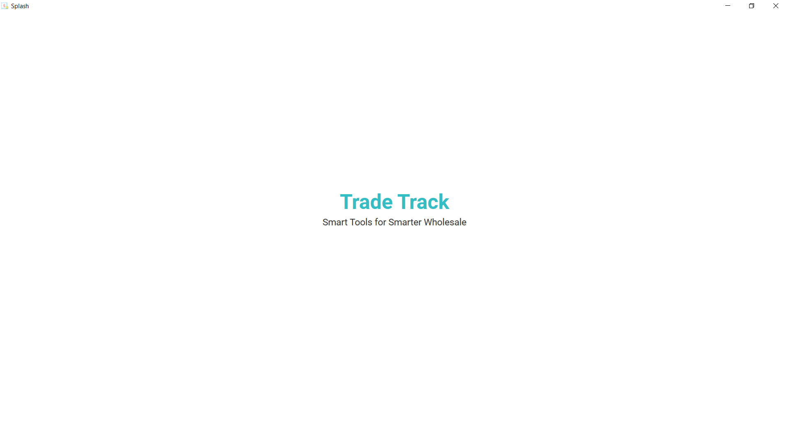
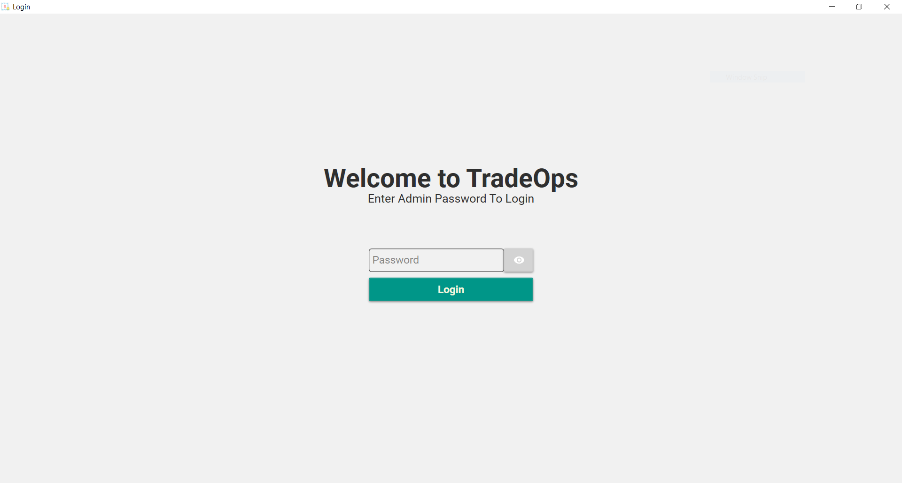
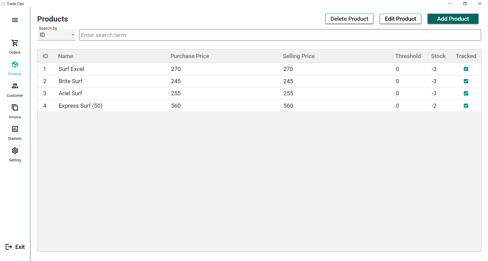
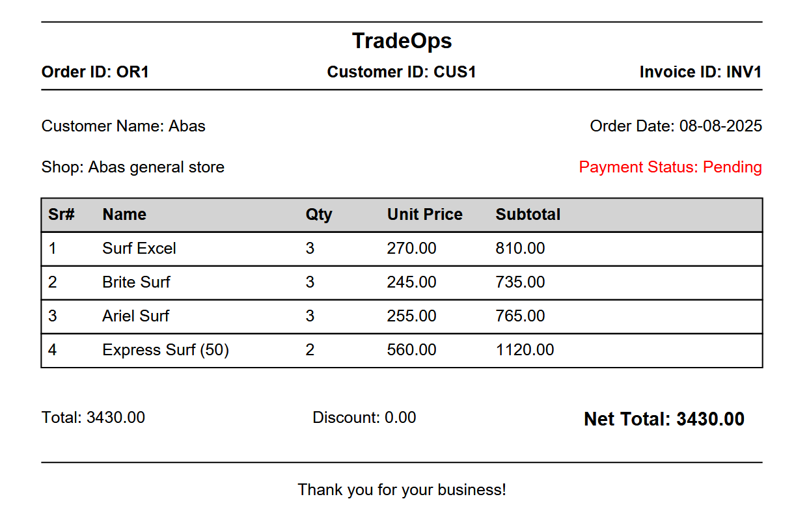

# **TradeOps — Wholesale Business Management System**

<p align="center">
  
  
  
  
</p>

<p align="center">
  <i>A powerful WPF-based wholesale business management platform for managing products, customers, orders, invoices, and profit tracking.</i>
</p>

---

## 📌 **Overview**

**TradeOps** is a **desktop-based wholesale business management system** built using **WPF, MVVM, and SQLite**.
It provides a simple yet powerful way to manage your business operations — from **inventory** to **customer data**, **orders**, **invoices**, and **sales insights** — all in one place.

---

## ✨ **Key Features**

* 📦 **Product Management** → Add, edit, delete, and track products with stock updates.
* 👥 **Customer Management** → Manage customer details and maintain purchase history.
* 🧾 **Order & Invoice Handling** → Create, update, and manage customer orders and invoices.
* 📊 **Profit Tracking** → Automatically calculate profits and sales metrics.
* 🖥️ **Modern MVVM Architecture** → Clean, scalable, and maintainable project structure.
* 🎨 **Material Design UI** → Clean, modern, and user-friendly interface.

---

## 🛠 **Tech Stack**

| Category         | Technology                    |
| ---------------- | ----------------------------- |
| **Frontend**     | WPF (XAML)                    |
| **Architecture** | MVVM Pattern                  |
| **Backend**      | C# .NET                       |
| **Database**     | SQLite                        |
| **UI Framework** | MaterialDesignInXAML          |
| **Tools**        | Visual Studio, NuGet Packages |

---

## ⚡ **Installation & Setup**

### **1. Clone the Repository**

```bash
git clone https://github.com/your-username/TradeOps.git
cd TradeOps
```

### **2. Open the Project**

* Open **TradeOps.sln** in **Visual Studio**.

### **3. Restore NuGet Packages**

* Go to: `Tools` → `NuGet Package Manager` → `Restore`.

### **4. Run the Project**

* Press **F5** or click **Start Debugging**.

---

## 🎯 **How to Use**

1. **Products Tab** → Add, edit, and manage products.
2. **Customers Tab** → Add and manage customer details.
3. **Orders Tab** → Create and manage customer orders.
4. **Invoices Tab** → View and generate invoices.
5. **Reports** → Check profit margins and sales insights.

---

## 📸 **Screenshots**

| Splash Screen                                         | Login Screen                                         | Product Screen                                         | Statistic Screen                                         |Invoice pdf                                         |
| ------------------------------------------------- | ------------------------------------------------ | ---------------------------------------------- | ---------------------------------------------- | ---------------------------------------------- |
|  | |  |  |  |

---

## 📂 **Project Structure**

```bash
TradeOps/
├── Models/             # Data Models (Customer, Product, Orders, etc.)
├── ViewModels/         # MVVM ViewModels for UI Binding
├── Views/              # XAML Views
├── DB/                 # SQLite Database
├── Helpers/            # Utility & Extension Classes
├── Assets/             # Icons, Images, UI Resources
└── README.md
```

---

## 🔮 **Future Enhancements**

* 🔐 **Role-Based Authentication** → Admin & User dashboards.
* 📊 **Advanced Sales Analytics Dashboard** → Graphs & KPIs.
* ☁️ **Cloud Database Sync** → Backup & cross-device access.
* 🔔 **Real-Time Notifications** → Low-stock alerts and reminders.

---

## 📬 **Contact**

**Fasih Ahmad KHan** — [LinkedIn](http://www.linkedin.com/in/fasih-ahmed-khan-a984ab226/) • [Portfolio](https://your-portfolio.com)
📧 **Email:** [fasihkhan124124@gmail.com](mailto:fasihkhan124124@gmail.com)

---
<p align="center">
  Made with ❤️ using WPF, C#, and SQLite
</p>


